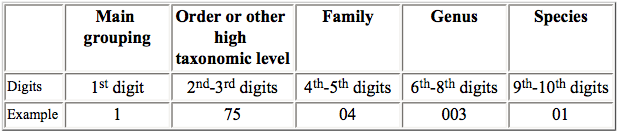

## Overview  

> Data scientists, according to interviews and expert estimates, spend from 50 percent to 80 percent of their time mired in the mundane labor of collecting and preparing data, before it can be explored for useful information. - [NYTimes (2014)](http://www.nytimes.com/2014/08/18/technology/for-big-data-scientists-hurdle-to-insights-is-janitor-work.html)

This tutorial will cover the `tidyr` and `dplyr` packages created by the mythical code wizard [Hadley Wickham](https://github.com/hadley) of `ggplot2` fame. The "gg" in `ggplot2` stands for the "grammar of graphics". Hadley similarly considers the functionality of the two packages `dplyr` and `tidyr` to provide the "grammar of data manipulation". The following topics will be covered:

### Resources  

- [Data wrangling cheatsheet (`dplyr`,`tidyr`)](http://ucsb-bren.github.io/refs/cheatsheets/data-wrangling-cheatsheet.pdf)
- [Data wrangling with R and RStudio](https://www.rstudio.com/resources/webinars/data-wrangling-with-r-and-rstudio/)
- [slides](http://ucsb-bren.github.io/env-info/wk03_dplyr/wrangling-webinar.pdf)
- [dplyr vignette: Introduction to dplyr](https://cran.rstudio.com/web/packages/dplyr/vignettes/introduction.html)
- [Two-table verbs](https://cran.rstudio.com/web/packages/dplyr/vignettes/two-table.html)
- [Window functions and grouped mutate/filter](https://cran.rstudio.com/web/packages/dplyr/vignettes/window-functions.html)
- [Databases](https://cran.rstudio.com/web/packages/dplyr/vignettes/databases.html)
- [Non-standard evaluation](https://cran.rstudio.com/web/packages/dplyr/vignettes/nse.html)
- [tidyr vignette: Tidy data](https://cran.r-project.org/web/packages/tidyr/vignettes/tidy-data.html)
- [Introduction to dplyr for Faster Data Manipulation in R](https://rpubs.com/justmarkham/dplyr-tutorial)
- [Environmental Informatics | ucsb-bren/env-info](http://ucsb-bren.github.io/env-info/)
- bigrquery tutorials:
- [A new data processing workflow for R: dplyr, magrittr, tidyr, ggplot2 | Technical Tidbits From Spatial Analysis & Data Science](http://zevross.com/blog/2015/01/13/a-new-data-processing-workflow-for-r-dplyr-magrittr-tidyr-ggplot2/) (newer)
- [Fetching BigQuery Data](http://dtkaplan.github.io/CVC/Data/Birthdays/Birthdays.html)

### Getting Started  

You can [download RStudio](https://www.rstudio.com/products/rstudio/download/) if you don't have latest version `0.99.892` (menu RStudio -> About RStudio), which has many nice additions for running R chunks and providing table of contents in Rmarkdown documents.  

Install and/or load the following packages:

```{r, eval=T,echo=T,warning=FALSE, message=F, results='hide'}

## Install packages if needed
# install.packages('devtools')
# install.packages('readr')
# install.packages('dplyr')
# install.packages('tidyr')
# install.packages('stringr')
# install.packages('ggplot2')

# Load packages
library(devtools)
library(readr)
# library(plyr)
library(dplyr)
library(broom)
library(tidyr)
library(stringr)
library(ggplot2)

# Check package versions after Packages pane -> Update
devtools::session_info()
```

### Why use dplyr and tidyr?
1. **Speed** - dplyr and tidyr are *really* fast  
2. **Readability** - the code syntax is straightforward and easy to read  
3. **Chaining** - *never break the chain*. More on this later  
4. **Integrates with ggplot2** - plot your data in the same workflow that you manipulate it with
5. **Can be used to analyze external databases without knowledge of additional database query languages** 

## Basics of dplyr and tidyr  
### Data frames and data tables
Although technically two separate packages, **dplyr** and **tidyr** were designed to work together and can basically be thought of as a single package. They are designed to work with data frames as is, but it is generally a good idea to convert your data to table data using the `read_csv()` or `tbl_df()` functions, particularly when working with large datasets.  

```{r, eval=T,echo=T,results='hide'}
## Comparing read.csv with read_csv
# Read in FAO data
fao   <- read.csv(file = 'data/FAO_1950to2012_111914.csv', stringsAsFactors = F) 
summary(fao)
head(fao)
# vs using read_csv
fao   <- read_csv(file = 'data/FAO_1950to2012_111914.csv') 
fao
# note: read_csv like read.csv(...)
#       also keeps original column names and converts to tbl_df()
names(fao) = make.names(names(fao), unique=T) # since original column names have duplicates

## Consider what happens with the following command
# fao # all entries are printed in your console
head(fao) # top five entries are printed in your console, columns wrap and can be difficult to follow if working with many variables
summary(fao)

## With dplyr
fao<-tbl_df(fao) # convert to table data
fao # now top 10 rows are shown along with data type of each variable. Variables that do not fit in console window are shown below.
glimpse(fao) # view all columns 
summary(fao)
if (interactive()) View(fao) # interactive==T if in Console, not knitting
```

### Tidy data
In general, it is good practice to have your data organized in a "tidy" format.  

In tidy data: 

* Each variable forms a column  
* Each observation forms a row  
* Each type of observational unit forms a table  

### Main verbs of dplyr and tidyr
Tidyr and dplyr are designed to help manipulate data sets, allowing you to convert between *wide* and *long* formats, fill in missing values and combinations, separate or merge multiple columns, rename and create new variables, and summarize data according to grouping variables. 

Dplyr and tidyr rely on the following main verbs:  

* Tidyr
+ `gather()` and `spread()` convert data between wide and long format  
+ `separate()` and `unite()` separate a single column into multiple columns and vice versa  
+ `complete()` turns implicit missing values in explicit missing values by completing missing data combinations

* Dplyr
+ `filter()` subset data based on logical criteria  
+ `select()` select certain columns  
+ `arrange()` order rows by value of a column  
+ `rename()` rename columns  
+ `group_by()` group data by common variables for performing calculations  
+ `mutate()` create a new variable/column  
+ `summarize()` summarize data into a single row of values  

Note that *unquoted* variable names are used by default in tidyr and dplyr functions. 

We'll use these verbs to process the raw FAO landings data into a more manageable tidy format.    


#### Gather and Spread  
First let's convert the FAO data from the current wide format to a long format.
```{r, eval=T,echo=T,results='hide'}
# Let's convert the fao data from it's current wide format to a long format using gather(). Note the use of helper fnc
d <- gather(fao, key='Year', value='Catch', num_range('X',1950:2012)) # ?select for num_range()

# We can convert back to wide format with the spread function by calling the previously created variables
spread(d,Year, Catch)

if (interactive()) View(d) # interactive==T if in Console, not knitting
# to handle: '-','...',' F','X'
```


#### Rename  
Now let's rename the columns to more manageable names (syntax is *new name* = *old name*)
```{r, eval=T,echo=T,results='hide'}
# Note the use of backticks around column names with special characters like "("
d <- dplyr::rename(d,
          country     = Country..Country.,
          commname    = Species..ASFIS.species.,
          sciname     = Species..ASFIS.species..2,
          spcode      = Species..ASFIS.species..1,
          spgroup     = Species..ISSCAAP.group.,
          spgroupname = Species..ISSCAAP.group..1,
          regionfao   = Fishing.area..FAO.major.fishing.area.,
          unit        = Measure..Measure.,
          year        = Year,catch=Catch)

```


#### Select  
Remove unwanted columns and observations.  
```{r, eval=T, echo=T,results='hide'}
# we could chose all the columns to keep
select(d,country, commname, sciname, spcode, spgroupname, regionfao, year, catch)

# but it's easier to just specify the columns to get rid of
d<-select(d,-spgroup,-unit)
```

There are also a number of **helper functions** that can be used in conjunction with `select()` to let you select without individually listing all those you wish to keep or drop. We used a helper function previously in our `gather()` function and now we'll try a few others.  
```{r,eval=T,echo=T,results='hide'}
# select all coloumns that begin with the letter s
select(d, starts_with('s'))

# select columns that match a regular expression
select(d, matches('*name'))

# select columns between two columns by referencing their position like normal [,x:y] syntax 
select(d, country, spcode:year)

# select every column (though I haven't found a situation where this is useful yet...)
select(d,everything())
```


#### Arrange  
Arrange entries by country, scientific name, fao region and year. You can use `desc()` within `arrange()` to control which variables you want to order in ascending or descending fashion 
```{r, eval=T,echo=T,results='hide'}
# arrange by country, sciname, regionfao, and year
d<-arrange(d,country,sciname,regionfao,year)

# if we'd like the years to be descending
arrange(d, country, desc(sciname), regionfao, desc(year))

# if we want to first order by species
arrange(d, sciname, country, regionfao, year)

```


#### Mutate  
Mutate can be used to edit existing variables or create new ones.
```{r, eval=T,echo=T, warning=F,results='hide'}
d <- mutate(d,
            year      = as.numeric(str_replace(year, 'X', '')), # strip X off all year values and convert to numeric
            catch     = as.numeric(str_replace(catch, c(' F','...','-'), replacement = '')),
            logcatch  = log10(catch)) # create a  new variable of log catch
```


#### Filter  
Remove unwanted rows/observations.
```{r, eval=T, echo=T,results='hide'}
# remove the "Totals" values and any years with NA catch values
d<-filter(d,!(country %in% c('Totals - Quantity (number)','Totals - Quantity (tonnes)')) & !is.na(catch))

# print data
d
```


### Piping and chaining code
While the above workflow is perfectly acceptable, dplyr allows you to use the *pipe* (`%>%`) operator to *chain* functions together. Chaining code allows you to streamline your workflow and make it easier to read.

When using the `%>%` operator, first specify the data frame that all following functions will use. For the rest of the chain the data frame argument can be omitted from the remaining functions.

Now consider the same process as before only using pipes and a single dplyr chain:

```{r,eval=T,echo=T,results='hide'}
d <- fao %>%
  gather(key='Year',value = 'Catch',num_range('X',1950:2012)) %>% # convert to long format
  rename(
    country     = Country..Country., # rename columns
    #country     = `Country (Country)`, # backtick trick!
    commname    = Species..ASFIS.species.,
    spcode      = Species..ASFIS.species..1,
    sciname     = Species..ASFIS.species..2,
    spgroup     = Species..ISSCAAP.group.,
    spgroupname = Species..ISSCAAP.group..1,
    regionfao   = Fishing.area..FAO.major.fishing.area.,
    unit        = Measure..Measure.,
    year        = Year,
    catch       = Catch) %>%
  select(-spgroup,-unit) %>% # drop spgroup, regionfaoname, and unit variables
  arrange(country,sciname,regionfao,year) %>% # order by country, sciname, regionfao, and year
  mutate(
    year        = as.numeric(str_replace(year, 'X', '')), # strip X off all year values and convert to numeric
    catch       = as.numeric(gsub(catch, pattern=c(' F'), replacement = '', fixed = T)),
    logcatch    = log10(catch)) %>% # create a  new variable of log catch 
  filter(!country %in% c('Totals - Quantity (number)','Totals - Quantity (tonnes)') & !is.na(catch)) # remove 'Totals' rows - rows: 1,114,596 -> 310,619

# print data frame
d
```

By chaining our code we were able to reproduce the same data frame without the need to continually overwrite it, and we can easily read each step in the process by observing the different verbs. We also only needed to reference the original data frame (fao) at the beginning of the chain rather than in each function call.


#### Complete  
Now our data is nice and tidy, but we realize that we actually want to retain NA values for years with missing catch data. We could just go back and remove the second argument from our `filter()` function. Or we could use the nifty `complete()` function to add in the missing combinations.  

```{r,eval=T,echo=T,results='hide'}
d %>%
  complete(year = 1950:2012)

d %>%
  group_by(country,sciname,commname,regionfao,spgroupname,spcode) %>%
  complete(year = 1950:2012) %>%
  ungroup()
```


#### Separate and Unite  
The `df$spcode` variable actually consists of 5 individual parts. 



We decide we want to create a new column for each taxonomic division of the spcode. We can accomplish this with `separate()` and undue it with `unite()`
```{r, eval=T,echo=T}
# create new variables for each taxonomic component 
d<-separate(d,spcode, into = c('maintaxa','order','family','genus','species'), sep = c(2,4,6,9))

# recombine the columns with unite 
d<-unite(d, col = spcode, maintaxa:species, sep = '') # Note - we can use helper functions here if needed
```


### Joins
So far we've been working with a single data frame, but dplyr provides a handful of really useful **join** functions that allow you to combine datasets in a variety of ways. To demonstrate the different methods of joining, we will combine our FAO dataset with a dataset of life history information from FishBase.

Dplyr allows for *mutating* joins and *filtering* joins. Mutating joins will combine information from both data frames in different ways, while filtering joins will filter a single dataset based on matches in another data set.

For joins to work, variable names must be the same in both datasets. This often requires using `rename()` prior to your join functions if you do not want to permanently alter the variable names in each dataset.

* Mutating joins
+ `left_join(a, b, by = c('...'))` join matching rows from b to a by matching variables in vector  
+ `right_join(a, b, by = c('...'))` join matching rows from a to b by matching variables in vector  
+ `inner_join(a, b, by = c('...'))` join data, retaining only rows in both a and b  
+ `full_join(a, b, by = c('...'))` join data, retaining all values, all rows


Lets use join functions to explore adding life history parameters to our FAO data
```{r,eval=T,echo=T,tidy = T, results='hide'}
# read in life history data
load(file = 'data/mpack.Rdata')
lh<-mpack$lh
rm(mpack)

lh<-lh %>%
  tbl_df() %>%
  dplyr::rename(sciname=sname) %>% # rename to sciname for joining
  select(sciname,vbk,temp,maxl,agem) %>% # select variables we wish to add
  slice(match(unique(lh$sname),lh$sname))

# first let's pull out all species US fisheries
us<- d %>%
  ungroup() %>%
  filter(country=='United States of America' & year==2012) %>%
  select(country, sciname, commname, spgroupname) %>%
  distinct()
  
# left join to retain all data in our d data frame. 
us %>% 
  left_join(lh, by = 'sciname') # we only need to specify the right hand data set to join lh with since we've piped

# right join to keep all lh data.  
us %>%
  right_join(lh, by = 'sciname')

# inner join to only keep data for which we have matches in both data sets
us %>%
  inner_join(lh, by = 'sciname')

# full join to keep all data for both data sets
us %>%
  full_join(lh, by = 'sciname')
```


## Analyzing and Manipulating Data  
Now that we have our cleaned data in a tidy format let's do some analyses. First, here are a few more simple examples of chaining code to select, filter, and arrange our data to obtain different subsets. 

```{r,eval=T,echo=T,results='hide'}
# Canada's fisheries from largest to smallest in 2012
d %>%
  filter(country=='Canada' & year==2012) %>%
  select(year,country,commname,catch) %>%
  arrange(desc(catch))

# All fisheries in the Northwest Atlantic with a catch over 1000 MT
d %>%
  filter(regionfao==21 & year==2012 & catch>=1000) %>%
  select(country,commname,regionfao,catch) %>%
  arrange(desc(catch))

# Which countries have the 10 largest shark fisheries?
d %>%
  filter(spgroupname=='Sharks, rays, chimaeras' & year==2012) %>%
  select(country,commname,catch) %>%
  arrange(desc(catch)) %>%
  slice(1:10)
```


### Grouping, Summarizing, and Mutating Data  
Dplyr uses two main verbs to analyze data, `summarize()` and `mutate()`. Summary functions will summarize data two produce a single row of output while mutate functions create a new variable the same length as the input data. For both functions, you first indicate the name of the variable that will be created and then specify the calculation to be performed.  

* Example: `totalcatch=sum(catch,na.rm=T)`

  

The `group_by()` function lets you specify the level across which to apply your calculations. 

* A key thing to remember is to always `ungroup()` your data if you intend to perform additional calculations, as grouped data frames can result in incorrect results downstream if performed at different levels.       


Using `group_by()` and `summarize()` let's calculate total global harvest from 1950 to 2012 for several groups of data

```{r,eval=T,echo=T,results='hide'}
# Total global harvest
global <- d %>%
  ungroup() %>%
  group_by(year) %>%
  dplyr::summarize(totalcatch=sum(catch,na.rm=T)) %>%
  ggplot(aes(x=year,y=totalcatch)) +
  geom_line()

# Global harvest by country
cntry<-d %>%
  group_by(year,country) %>%
  dplyr::summarize(totalcatch=sum(catch, na.rm=T)) %>%
  ungroup() %>% # -- Here's an example of why you need to ungroup! --
  dplyr::arrange(country)

# Global harvest by species category
spcatch <- d %>%
  group_by(year,spgroupname) %>%
  dplyr::summarize(totalcatch=sum(catch, na.rm=T)) %>%
  ungroup() %>% 
  arrange(spgroupname)

# USA harvest by species category over time
usa<- d %>%
  filter(country=='United States of America') %>%
  group_by(year,country,spgroupname) %>%
  dplyr::summarize(totalcatch=sum(catch,na.rm=T)) %>%
  ungroup() %>%
  arrange(spgroupname)
```


Now let's use mutate to calculate some additional information for our datasets  
```{r, eval=T,echo=T,results='hide'}
# Calculate what % of global catch each country contributes in each year and for rank each year by that %
cntry %>%
  group_by(year) %>%
  mutate(
    globalcatch = sum(totalcatch,na.rm=T),
    globalrank  = dense_rank(totalcatch)) %>% # global catch and cntry rank
  group_by(year,country) %>% # now we group by a different level before our next calculation
  mutate(
    percglobal = 100*(totalcatch/globalcatch)) %>%
  group_by(country) %>%
  mutate(
    ingrouprank = dense_rank(totalcatch))
```  

### Using Dplyr with `broom` and `ggplot2`

One of the best aspects of working with tidy data and `dplyr` is how easy it makes it to quickly manipulate and plot your data. Property organized, it's a piece of cake to quickly make summaries and plots of your data without making all kinds of "temporary" files or lines of spaghetti code for plotting. You can also basically eliminate loops from your coding for all situations except that those that require dynamic updating (e.g. population models). 

For this next exercise, we're going to use `tidyr`, `dplyr`, `broom`, and `ggplot2` to fit a model, run diagnostics, and plot results. 

It's 3am. You've been chasing the same cryptic error message for two days (<font color = 'red'> `Error: towel not found, don't panic!`</font>). You decide enough is enough: you're going to pack it in, buy a boat and become a fisherman. The only problem is, years of coding have left you with no knowledge of the outside world besides what R and data can tell you. How are you supposed to know what to fish for, or where to fish? Luckily, you have some data, so you turn to your laptop one last time before hurling it off of a cliff in a ritualistic sacrifice to the sea gods. 

You want to find a fishery to join based on two criteria: high average catch, and low average variability. You might now know these data though, so you want to be able to predict what fishery to join based on geographic and life history traits. 

Our first goals: 

1. Generate a unique ID for each fishery

2. Calculate the mean log lifetime catch of each fishery

3. Calculate the coefficient of variation of each fishery

4. Filter out fisheries with short time series

```{r, eval=T, echo=T}

# Prep our data
dat <- d %>%
  ungroup() %>% #Often a good idea to ungroup before starting something new
  mutate(id = paste(country,spcode,regionfao, sep = '_')) %>% #Generate a unique ID for each fishery
  group_by(id) %>%
  mutate(mean_log_catch = mean(logcatch, na.rm = T), cv_log_catch = sd(logcatch, na.rm = T)/mean(logcatch, na.rm = T), length_catch = sum(is.na(logcatch) == F & logcatch >0)) %>% # we want to keep some of the other data as well
  filter(year == max(year) & length_catch > 10 & is.finite(mean_log_catch) == T & cv_log_catch >0) %>% # We don't want repeated entries, so let's just grab one random year
  dplyr::select(-year, -catch, -logcatch)

# Always plot!
ggplot(dat, aes(mean_log_catch,cv_log_catch)) + 
  geom_point()

```

OK, we see we're onto something here: there's clearly a relationship between average catch and the CV of the catch. We want to build a model that predicts that. Let's create a composite score of the mean log catch and the inverse of the CV. We're going to scale the log catches by the maximum log catch, and the CV by the the maximum of 1/CV. We also want to add in our nice life history data 

```{r, eval=T, echo=T}

regdat <-  dat %>%
  ungroup() %>% #we want global statistics now
  mutate(scaled_ml_catch = mean_log_catch/max(mean_log_catch), scaled_cv_catch =  (cv_log_catch/min(cv_log_catch))^-1, fishiness = scaled_ml_catch + scaled_cv_catch) %>%
  left_join(lh, by = 'sciname')

regplot <- regdat %>% #great thing about ggplot is the ability to save as an object and use and modify later
  ggplot(aes(mean_log_catch,cv_log_catch, fill = fishiness)) + 
  geom_point(shape = 21) + 
  scale_fill_gradient(low = 'red',high = 'green')

regplot # grea

```

Now we're getting somewhere! Now, lets run a regression using life history and geographic variables to try and predict the quality of fishing. 

```{r, eval=T, echo=T, results='hide'}

reg_vars <- c('regionfao', 'spgroupname', 'vbk','maxl','temp') #specify variables you want

class(regdat$regionfao) #whoops, it things FAO region is an integer, we want a factor

filtered_dat <- regdat %>%
  ungroup() %>%
  mutate(has_all = apply(is.na(regdat[,reg_vars]) == F, 1,all)) %>%
  filter(has_all == T) %>%
  mutate(regionfao = as.factor(regionfao),spgroupname = as.factor(spgroupname))

reg_fmla <- as.formula(paste('fishiness ~',paste(reg_vars, collapse = '+'), sep = '')) #create regression formula

fish_model <- lm(reg_fmla, data = filtered_dat) #run a linear regression
summary(fish_model)

```

Now we've got a model! we're close to being able to use data to predict where we'll start our fishing operation. But, while we know nothing about fishing, we are good statisticians, and we know we should look at our regression before using it to make a big life decision. This is where `broom` comes in. R has all kinds of great functions, like `summary()` to look at regressions. But, they can be a little ad hoc, and difficult to manipulate. `broom` helps us tidy up our regression data. First, suppose that we want a better way to look at summary statistics from the regression. The `glance()` function from the `broom` package extracts important summary statistics from the model, like the *R^2^*, the AIC, and the BIC.

```{r, eval=T, echo=T, results='hide'}
library(broom)
reg_summary <- glance(fish_model)

reg_summary
```

Unfortunately, our model is pretty poor; it only explains ~20% of the variation in the `fishiness` variable, but hopefully it's better than guessing. Let's dig into this model a bit more. We're going to use the `tidy()` function from the `broom` package to provide neat summaries of the model coefficients. 

```{r, eval=T, echo = T}

tidy_model <- tidy(fish_model)

tidy_model$variable<- as.factor(tidy_model$term) #convert terms to factors

tidy_model$variable <- reorder(tidy_model$variable, tidy_model$p.value) #sort variables by pvalue

tidy_model$short_pval<- pmin(tidy_model$p.value,0.2) #create abbreviated version

regression_plot <- (ggplot(data=tidy_model,aes(x=variable,y=estimate,fill=short_pval))+
                      geom_bar(position='dodge',stat='identity',color='black')+
                      scale_fill_gradient2(high='black',mid='gray99',low='red',midpoint=0.1,
                                           breaks=c(0.05,0.1,0.15,0.2),labels=c('0.05','0.10','0.15','>0.20')
                                           ,name='P-Value',guide=guide_colorbar(reverse=T))
                    +theme(axis.text.x=element_text(angle=45,hjust=0.9,vjust=0.9))+
                      geom_errorbar(mapping=aes(ymin=estimate-1.96*std.error,ymax=estimate+1.96*std.error))+
                      xlab('Variable')+
                      ylab(paste('Marginal Effect on ',names(fish_model$model)[1],sep='')) + 
                      coord_flip())

regression_plot

```

So, we can now see that most of the significant terms are region specific, and the life history data doesn't give us a whole lot of information on where we should start fishing. So far, the model is saying go fish in China, and maybe avoid salmons, halibuts, and tunas. 

Before we charge off and use these results though to decide where we're starting our new life, we're now going to use the `augment()` function in the `broom` package to help us run some diagnostics on the regression. The `augment` function takes our original data passed to the regression, and adds all kinds of things, like the values predicted by the model and the residuals. This makes it very useful for regression diagnostics. First off, we might want to check whether our errors are actually normally distributed

```{r, eval=T, echo=T}

auged_reg <- augment(fish_model)


obs_v_pred <- auged_reg %>%
  ggplot(aes(fishiness, .fitted)) + 
  geom_point(shape = 21, size = 4, alpha = 0.6, fill = 'steelblue4') + 
  geom_abline(aes(slope=1, intercept = 0)) + 
  xlab('ovbserved') + 
  ylab('predicted') + 
  geom_label(aes(0.25,0.7), label = paste('R2 = ', round(reg_summary$r.squared,2), sep = ''))

obs_v_pred

  qq_plot <- auged_reg %>% #create quantile-quantile plot
    ggplot(aes(sample = .resid)) +
    stat_qq(shape = 21, size = 4, alpha = 0.6, fill = 'steelblue4') +
    xlab('Theoretical') +
    ylab('Sample')

  qq_plot

```

We see that our data are in fact normally distributed, that's good! Let's check for heteroskedasticity and model misspecification. 

```{r, eval=F, echo=T}

  hetsk_plot <- auged_reg %>% #plot fitted vs residuals
    ggplot(aes(.fitted, .resid)) +
    geom_point(shape = 21, size = 4, alpha = 0.6, fill = 'steelblue4') +
  geom_hline(aes(yintercept = 0)) + 
    xlab('Predicted') +
    ylab('Residuals')

hetsk_plot

```

Looks a little iffy, we've got some heteroskedasticity going on.  Let's try and see where it is. The great thing about `broom` is that it makes it really easy to manipulate data and plot diagnostics based on the original data. 

```{r, eval=T, echo=T}


  hetsk_plot2 <- auged_reg %>% 
    ggplot(aes(.fitted, .resid, fill = spgroupname)) +
    geom_point(shape = 21, size = 4, alpha = 0.6) +
  geom_hline(aes(yintercept = 0)) + 
    xlab('Predicted') +
    ylab('Residuals')

hetsk_plot2


```

So, we see here that the culprit are the herrings and salmons. That tells us to be a little cautious in our predictive ability and estimated errors based on this model, and maybe we need to do a better job of clustering our errors. Let's look at things another way. We saw from the coefficient plot that the region effects are the most significant in the model. How confident are we in those?

```{r, eval=T, echo=T}

  regional_bias <- auged_reg %>% #Check residuals by group
  ggplot(aes(regionfao,.resid)) + 
  geom_boxplot(fill = 'steelblue4') + 
  geom_hline(aes(yintercept = 0)) + 
  xlab('FAO Region') + 
  ylab('Residuals')

regional_bias

  species_bias <- auged_reg %>%
  ggplot(aes(spgroupname,.resid)) + 
  geom_boxplot(fill = 'steelblue4') + 
  geom_hline(aes(yintercept = 0)) + 
  xlab('Species Category') + 
  ylab('Residuals') + 
    coord_flip()
  
  species_bias
```

All in all then, we've got some heteroskedasticity that makes us a little suspicious of our standard errors, but no major biases in our estimation. Our life choice model works! Let's move to China and fish whatever, the model says it doesn't matter. 

### In defense of `plyr`

One quick note. `dplyr` has taken over for a lot of the things we used to use `plyr` for. But, `plyr` is still useful for manipulating other types of objects instead of data frames. Specifically, I use `plyr` to convert lists and arrays to data frames. 

Sometimes its useful to use lists. Suppose that I have a function that I want to evaluate a bunch of times. Loops can be cumbersome for a variety of reasons. Let's write a function and apply it over a vector instead. 

```{r, eval=T, echo=T}

foo <- function(x){ #random function
  
  y <- x^2
  
  return(y)
}

food <- lapply(1:100,foo) #this can be more efficient and simpler than loops

```

Now, we've applied our function over 100 values. But, they're stuck in list form. `plyr` to the rescue! So long as each element in every list has the same dimensions, `ldply` will "smash" the list into a data frame

```{r, eval=T, echo=T}


foody <- plyr::ldply(food)

```

The syntax is simple. `ldply` converts lists to data frames. `adply` converts arrays to data frames. You get the idea. Huge warning here. **Make sure** you load the `plyr` library **before** `dplyr`. Otherwise, bad bad things can happen. R will even throw a warning if you do it the other way around. Or, more simply, instead of loading the library, just use `plyr::ldply`. This loads that function for that instance, without actually loading into the environment and masking other things. 


### A quick warning on speed

So far, we've been preaching the `dplyr` gospel pretty hard. All in all, it makes code faster, more efficient, and much easier to read. But, there are times when its best to keep it simple, especially where speed is critical. This is less `dplyr`'s fault, than some issues with data frames themselves. 

We are going to compare two functions that do the same thing, one using dplyr and data frames and one that uses more basic R functions. The goal is a function that calculates the mean length of catch history in an fao region

```{r, eval=T, echo=T}

dplyr_fun <- function(region,dat)
{
  out <- dat %>%
    filter(regionfao == region) %>%
    summarise(mean_length = mean(length_catch))
  
  return(out)
}

basic_fun <- function(region,dat)
{
  out <- mean(as.numeric(dat[dat[,'regionfao'] == region,'length_catch']))
  return(out)
}

regions <- rep(unique(as.character(regdat$regionfao)), 100) #thing to test

startime <-  proc.time() #time the dplyr version
a <- lapply(regions, dplyr_fun, dat = regdat)
t1 <- proc.time() - startime

startime <-  proc.time() #time the basic version
b <- lapply(regions, basic_fun, dat = as.matrix(regdat))
t2 <- proc.time() - startime

t1[1]/t2[1]

all(plyr::ldply(a)$V1 == plyr::ldply(b)$V1) #check and make sure they do the same thing

```

The `dplyr` version of the function takes nearly 7 times as long as the same function in basic notation! The difference between .45 and 3.1 seconds doesn't matter much in most cases, but if you're doing huge numbers of simulations, say in an MCMC, this starts to add up. This can be the difference between a model running a day and a few hours. 

This time sink doesn't always hold true, `dplyr` will often be faster than bunches of nested loops, but when speed is a priority, it's worth checking to see using matrices instead of data frames and `dplyr` will save you some serious time. 

## Advanced Dplyr Applications
### Underscore Functions  
Often, when writing functions with dplyr we may want to be able to specify different grouping variables. But wait, dplyr arguments use unquoted variable names! Have no fear, underscore is here!

Check out the following two functions:

```{r,eval=F,echo=T}
# function using standard dplyr functions
fun1<-function(x,gpvar1,gpvar2,gpvar3){
  y<-x %>%
    group_by(gpvar1) %>%
    mutate(globalcatch=sum(totalcatch,na.rm=T),globalrank=dense_rank(totalcatch)) %>% # global catch and cntry rank
    group_by(gpvar2) %>% # now we group by a different level before our next calculation
    mutate(percglobal=100*(totalcatch/globalcatch)) %>%
    group_by(gpvar3) %>%
    mutate(ingrouprank=dense_rank(totalcatch))
  return(y)
}

fun1(spcatch, gpvar1 = year, gpvar2 = c(year,country), gpvar3 = country) # !!!!! THIS WILL NOT WORK !!!!!

# function using underscores
fun1<-function(x,gpvar1,gpvar2,gpvar3){
  y<-x %>%
    group_by_(gpvar1) %>%
    mutate(globalcatch=sum(totalcatch,na.rm=T),globalrank=dense_rank(totalcatch)) %>% 
    group_by_(gpvar2) %>% 
    mutate(percglobal=100*(totalcatch/globalcatch)) %>%
    group_by_(gpvar3) %>%
    mutate(ingrouprank=dense_rank(desc(totalcatch)))
  return(y)
}  

# apply function to species category and country datasets
spcatch<-fun1(spcatch,gpvar1 = c('year'), gpvar2 = c('year','spgroupname'), gpvar3 = c('spgroupname')) 
cntry<-fun1(cntry,gpvar1 = c('year'), gpvar2 = c('year','country'), gpvar3 = c('country'))   
```  


### Using Dplyr to Query External Databases

Need to setup Google account first, per [A new data processing workflow for R: dplyr, magrittr, tidyr, ggplot2 | Technical Tidbits From Spatial Analysis & Data Science](http://zevross.com/blog/2015/01/13/a-new-data-processing-workflow-for-r-dplyr-magrittr-tidyr-ggplot2/).

```{r bigrquery, eval=F}
# library(dplyr)
library(bigrquery) # install.packages('bigrquery')
sql<-"select * from [publicdata:samples.shakespeare]"
shakespeare <-query_exec(sql, project ="test-bigquery-1243",max_pages=Inf)
```


#### Example Analyses

- [NOAA Storm Data - a Brief Analysis of Impact on Health and Economy](http://rstudio-pubs-static.s3.amazonaws.com/25871_1ffdd88781bd4e6194d93fd327a25659.html)
- [dplyr example with fish data](http://rpubs.com/dogle/31773) (more on [Introductory Fisheries Analysis with R | fishR](https://fishr.wordpress.com/ifar/))
- [rnoaa - Access to NOAA National Climatic Data Center data](https://ropensci.org/blog/2014/03/13/rnoaa/)
